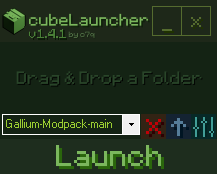
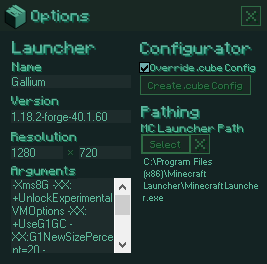

#### https://github.com/o7q/cubeLauncher
#### Welcome! cubeLauncher is a simple, lightweight installation manager for Minecraft. I originally made this tool for me and my friends but now you can use it too!
 

# Overview
This tool works like CurseForge except it is inside of a single executable file without the need of an installer. It creates its own launcher profile within the Minecraft launcher preventing it from interfering with any previous installations.

The options menu includes several features that allow you to change the settings for the installation, such as the name, arguments, resolution, etc.

For modpack makers I included a feature called the ".cube override config file". \
Clicking the "Create .cube Config" button will create a blank config directory alongside "cubeLauncher.exe". \
he file includes multiple arguments that the modpack creator can specify.

To utilize the config file, place the ".cube" folder inside the installation folder you would like those settings to apply to. \
"version" should be the same as what it says inside of the launcher but without the "release" text.

If you would like a modloader such as forge or fabric to auto install when installing a folder you can specify it under the "modloader" argument. \
Place the installer file alongside "config.cube" and specify the name of that file after "modloader:". \
 

## <b>Components</b>
<b>Drag & Drop a Folder Window:</b> Dragging a folder here will install and then search for modloaders for the dropped folder \
<b>Installation Selection Dropdown:</b> Selects an installation to be launched \
<b>Open Installation Directory Button:</b> Opens the directory for the selected installation \
<b>Delete Installation Button:</b> Deletes the selected installation \
<b>Options Button:</b> Opens options window \
<b>Launch Button:</b> Launches the selected installation with the specified arguments \
<b>Name Input:</b> Minecraft launcher name \
<b>Version Input:</b> Minecraft launcher version \
<b>Resolution Input:</b> Minecraft launcher resolution \
<b>Arguments Input:</b> Minecraft launcher arguments \
<b>Override .cube Config Checkbox:</b> Overrides the .cube file of all installations \
<b>Create .cube Config Button:</b> Creates a blank config directory alongside "cubeLauncher.exe" \
<b>Select MC Launcher Path Directory Button:</b> Specify an alternate path for the Minecraft Launcher \
<b>Clear MC Launcher Path Directory Button:</b> Resets the Minecraft Launcher path to default \
 

 \
 \
 

Running C# .NET Framework 4.8. \
If you want to compile the code yourself I highly recommend using Visual Studio.