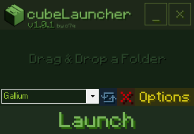
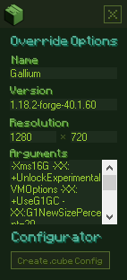

# cubeLauncher
A simple and lightweight installation manager for Minecraft.

cubeLauncher: https://github.com/o7q/cubeLauncher

Running C# .NET Framework 4.8.
If you want to compile the code yourself I highly recommend using Visual Studio.