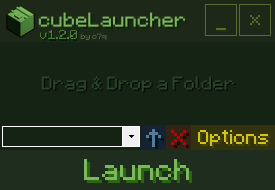
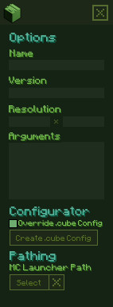

### https://github.com/o7q/cubeLauncher
 

Welcome! cubeLauncher is a simple, lightweight installation manager for Minecraft.\
I made this tool for me and my friends but now you can use it too!

This tool works like CurseForge except it is inside of a single executable file without the need of an installer. It creates its own launcher profile within the Minecraft launcher preventing it from interfering with any previous installations.\
 

## Overview
The options menu includes several features that allow you to change the settings for the installation, such as the name, arguments, resolution, etc.

For modpack makers I included a feature called the ".cube override config file".\
Clicking the "Create .cube Config" button will create a blank config directory alongside "cubeLauncher.exe".\
he file includes multiple arguments that the modpack creator can specify.

To utilize the config file, place the ".cube" folder inside the installation folder you would like those settings to apply to.\
"version" should be the same as what it says inside of the launcher but without the "release" text.

If you would like a modloader such as forge or fabric to auto install when installing a folder you can specify it under the "modloader" argument.\
Place the installer file alongside "config.cube" and specify the name of that file after "modloader:".\
 

\
\
 

Running C# .NET Framework 4.8.\
If you want to compile the code yourself I highly recommend using Visual Studio.