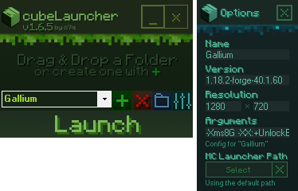

#### https://github.com/o7q/cubeLauncher/releases
### Welcome! cubeLauncher is a simple, lightweight installation manager for Minecraft. I originally made this tool for me and my friends but now you can use it too!

<br>



<br>

# Overview
This tool works like CurseForge except it is inside of a single executable file without the need of an installer. It creates its own launcher profile within the Minecraft launcher preventing it from interfering with any previous installations.

Using and creating config files manually can be accomplished by following these steps:
1. Inside of the directory for the installation, create a folder called `.cube`
2. Inside of the `.cube` folder, create a file called `config.cube`
3. Inside of the `config.cube` file, paste the following code:
```
# CUBELAUNCHER OVERRIDE CONFIG
name: 
version: 
width: 
height: 
arguments: 
modloader: 
```

<br>

If you would like a modloader such as forge or fabric to auto install when installing a folder you can specify it under the `modloader` argument inside `config.cube`. \
Place the installer file alongside `config.cube` and specify the name of that file after `modloader: `.

<br>

## <b>Components</b>
`Drag & Drop a Folder Window` Dragging a folder here will install and then search for modloaders for the dropped folder \
`Installation Selection Dropdown` Selects an installation to be launched \
`Create Installation Button` Create a blank installation \
`Delete Installation Button` Deletes the selected installation \
`Open Installation Directory Button` Opens the directory for the selected installation \
`Options Button` Opens options window \
`Launch Button` Launches the selected installation with the specified arguments \
`Name Input` Minecraft launcher name \
`Version Input` Minecraft launcher version \
`Resolution Input` Minecraft launcher resolution \
`Arguments Input` Minecraft launcher arguments \
`Select MC Launcher Path Button` Specify an alternate path for the Minecraft Launcher \
`Clear MC Launcher Path Directory` Button Resets the Minecraft Launcher path to default

<br>

Running C# .NET Framework 4.8. \
If you want to compile the code yourself I highly recommend using Visual Studio.